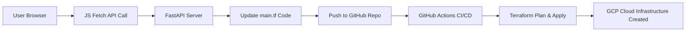

# 🚀 Automated Cloud Infrastructure Deployment using Terraform & Google Cloud

> **Developed by: *Mahreen Aisha***
> A modern Infrastructure-as-Code (IaC) workflow integrating **Frontend**, **FastAPI**, **Terraform**, **GitHub Actions**, and **Google Cloud Platform** for automated resource provisioning.

---

## 📌 Project Overview

This project demonstrates **end-to-end automation** for cloud infrastructure creation using a web interface:

1️⃣ User interacts with a **Frontend** (HTML/CSS/JS)

2️⃣ Frontend sends API requests to a **FastAPI Backend**

3️⃣ FastAPI **modifies Terraform config** (`main.tf`)

4️⃣ Backend **pushes changes** automatically to **GitHub**

5️⃣ **GitHub Actions CI/CD** runs Terraform commands

6️⃣ Google Cloud Platform **deploys resources automatically**

---

## 🏗️ Technologies Used

| Layer            | Tools                             |
| ---------------- | --------------------------------- |
| Frontend         | HTML, CSS, JavaScript (Fetch API) |
| Backend API      | FastAPI (Python)                  |
| IaC Automation   | Terraform                         |
| CI/CD            | GitHub Actions                    |
| Cloud Provider   | Google Cloud Platform             |
| Auth / CLI Tools | gcloud CLI, Service Accounts      |

---

## 🔁 System Architecture Workflow



---

### 🎯 Features Automated using Terraform on GCP

| Resource                            | Status             |
| ----------------------------------- | ------------------ |
| Cloud Storage Bucket                | ✔ Implemented      |
| Compute Engine VM                   | ✔ Implemented      |
| Public Access Prevention for Bucket | ✔ Enforced         |
| Startup script in VM (`test.txt`)   | ✔ Verified via SSH |

---

## ⚙️ Terraform Configuration (main.tf)

Includes both Cloud Storage & Compute Engine:

```hcl
terraform {
  required_providers {
    google = {
      source  = "hashicorp/google"
      version = "~> 7.8.0"
    }
  }
}

provider "google" {
  project = "<PROJECT_ID>"
  region  = "us-central1"
}

# Cloud Storage Bucket
resource "google_storage_bucket" "my_bucket" {
  name          = "vit-project-githubdemo-bucket"
  location      = "US"
  force_destroy = true
  public_access_prevention = "enforced"
}

# Compute Engine VM
resource "google_compute_instance" "vm_instance" {
  name = "vm-from-terraform"
  machine_type = "e2-micro"
  zone = "us-central1-a"

  boot_disk {
    initialize_params {
      image = "debian-cloud/debian-11"
    }
  }

  network_interface {
    network = "default"
  }

  metadata_startup_script = "echo hi > /test.txt"
}
```

---

## 🤖 GitHub Actions CI/CD (terraform.yml)

* Automatically runs on every push
* Executes:
  ✔ terraform init
  ✔ terraform fmt
  ✔ terraform plan
  ✔ terraform apply

Uses secure SA key:

```yaml
env:
  GOOGLE_CREDENTIALS: ${{ secrets.GCP_SA_KEY }}
```

---

## 🔐 Google Cloud Authentication

Required commands:

```sh
gcloud auth application-default login
gcloud auth application-default set-quota-project <PROJECT_ID>
gcloud billing projects link <PROJECT_ID> --billing-account=<BILLING_ACCOUNT_ID>
```

Verify permissions:

```sh
gcloud projects get-iam-policy <PROJECT_ID> \
 --flatten="bindings[].members" \
 --format="table(bindings.role,bindings.members)"
```

---

## 🖥️ Running the Backend (FastAPI)

```sh
uvicorn main:app --reload
```

API Example:

```js
fetch("http://127.0.0.1:8000/create-bucket")
```

---

## 🧑‍💻 Running the Frontend

Simply open:

```
frontend/index.html
```

Ensure FastAPI server is running locally.

---

## 📸 Screenshots (To be added)

| Title                           | Description                           |
| ------------------------------- | ------------------------------------- |
| **Front-end UI**                | Buttons to trigger bucket/VM creation |
| **GitHub Actions Workflow Run** | Apply logs                            |
| **Bucket in GCP Console**       | Confirm successful deployment         |
| **SSH into VM**                 | Startup script `test.txt` verified    |

> 📌 Place screenshots inside: `/assets/screenshots/`

---

## 🔐 Secrets Required

| Secret Name  | Purpose                                     |
| ------------ | ------------------------------------------- |
| `GCP_SA_KEY` | Service Account key JSON for Terraform auth |

---

## 🧑‍🏫 Key Learning Outcomes

* Cloud Infrastructure Automation using Terraform
  
* GitHub Actions CI/CD for Production-Ready Workflows
  
* Secure Service Account Authentication
  
* End-to-End Architecture Design and Deployment
  
* Public Access Prevention + Resource Security Best Practices

---

## 🛠 Troubleshooting Notes

| Issue                              | Fix                                      |
| ---------------------------------- | ---------------------------------------- |
| Terraform failed due to no billing | Add billing account in Google Cloud      |
| Provider version mismatch          | Update version + re-run `terraform init` |
| Formatting errors in plan stage    | Run `terraform fmt` locally              |

---

## 🏁 Conclusion

This project successfully demonstrates:

✔ Full automation pipeline

✔ Self-service cloud infrastructure deployment

✔ Practical DevOps + Cloud + IaC workflow

✔ Real cloud resource provisioning on GCP

---

### ⭐ Show support!

If you like this project, please ⭐ the repo!
Feel free to contribute and explore further enhancements!

---
